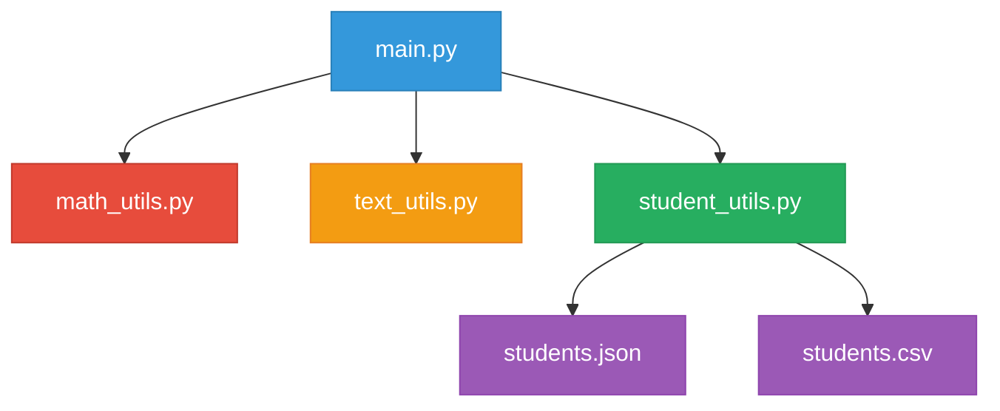

<div align="center">
  
</div>

<div align="center">

[](https://python.org)


</div>

---

## Overview

The **Modular Student Utility System (MSUS)** is a collaborative Python application designed to provide comprehensive utility functions for analyzing student-related data including grades, names, and numerical operations. Built with modular programming principles, the system demonstrates clean code architecture, data persistence, and robust error handling.

<div align="center">

### Key Highlights

| Feature | Description |
|---------|-------------|
| **Modular Design** | Clean separation of concerns across multiple modules |
| **Data Persistence** | Automatic JSON/CSV save and load functionality |
| **Error Handling** | Comprehensive input validation and error recovery |
| **Analytics** | Built-in statistics and data analysis tools |

</div>

---

## Features

<table>
<tr>
<td width="50%">

### Mathematical Operations
- Count even/odd numbers in lists
- Calculate sum of digits
- Find averages and statistical ranges
- Advanced mathematical computations

### Text Processing
- Reverse sentence word order
- Convert numeric grades to letters
- Count words and characters
- Vowel/consonant analysis

</td>
<td width="50%">

### Student Management
- Add and remove student records
- Lookup student information
- Database statistics and analytics
- Bulk data operations

### File Operations
- JSON data persistence
- CSV import/export functionality
- Automatic backup systems
- Data integrity validation

</td>
</tr>
</table>

---

## Project Structure

```
MSUS/
├── main.py            — Central controller with menu interface
├── math_utils.py      — Mathematical processing utilities
├── text_utils.py      — Text manipulation and grading functions
├── student_utils.py   — Student data management and file operations
├── students.json      — Auto-generated student database
├── students.csv       — CSV export/import file
└── README.md          — Project documentation
```

<div align="center">
</div>


### Module Relationships


